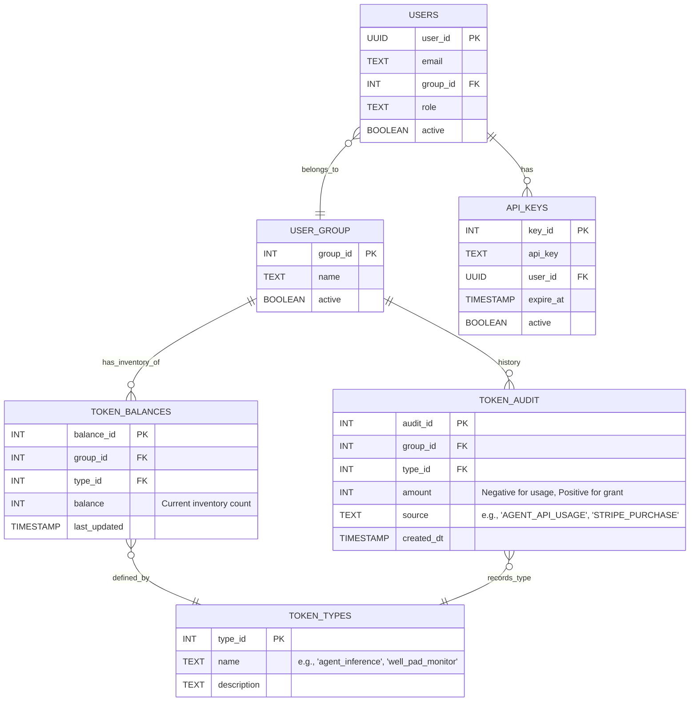

# LLM Token Counter POC

A **FastAPI** middleware service that acts as an accounting layer between your applications and LLM providers.

It validates API credentials, measures token consumption (via **tiktoken**), and atomically deducts from per-group, per-feature token buckets stored in PostgreSQL.

---

## Architecture

```
sequenceDiagram
    autonumber
    actor Client as Client App
    participant Middleware as Token Middleware API (this service)
    participant DB as Postgres DB
    participant TikToken as TikToken Library

    Note over Client, Middleware: POST /api/v1/tokens/deduct

    Client->>Middleware: Send Payload (Email, API Key, Feature, Text/Quantity)

    rect rgb(240, 248, 255)
        Note right of Middleware: 1. Validate User & Creds
        Middleware->>DB: SELECT * FROM api_keys JOIN users WHERE key=?
        DB-->>Middleware: Return User & Group ID
        alt Invalid Key or User Inactive
            Middleware-->>Client: 401 Unauthorized
        end
    end

    rect rgb(255, 250, 240)
        Note right of Middleware: 2. Count Tokens (variable-cost only)
        Middleware->>TikToken: Encode(text_string)
        TikToken-->>Middleware: Return Integer (e.g. 18 tokens)
    end

    rect rgb(240, 255, 240)
        Note right of Middleware: 3. Atomic Check & Deduct
        Middleware->>DB: UPDATE token_balances SET balance = balance - N WHERE group_id=? AND type_id=? AND balance >= N RETURNING balance
        alt Insufficient balance
            Middleware-->>Client: 402 Payment Required
        else Success
            Middleware->>DB: INSERT INTO token_audit (...)
            Middleware-->>Client: 200 OK
        end
    end
```

---

## Database Schema (ER Diagram)



---

## Quickstart

### Prerequisites

- Docker & Docker Compose **or** Python 3.12+ and a running PostgreSQL instance

### With Docker Compose

```bash
docker compose up --build
```

The API is available at <http://localhost:8000>.  
Interactive docs: <http://localhost:8000/docs>

### Without Docker

```bash
# 1. Install dependencies
pip install -r requirements.txt

# 2. Set the database URL
cp .env.example .env
# Edit .env and set DATABASE_URL

# 3. Start the API (tables are created automatically on first run)
uvicorn main:app --reload

# 4. (Optional) Seed sample data
python seed.py
```

---

## API Reference

### `POST /api/v1/tokens/deduct`

Deduct tokens from a group's balance.

#### Scenario A – Variable cost (agent inference)

Supply `payload_to_measure`; tiktoken measures the token count automatically.

**Request**
```json
{
  "email": "nfinch@somedomain.com",
  "api_key": "deadbeef-cafe-babe-01234abecdef0",
  "feature_type": "agent_inference",
  "payload_to_measure": "Can you analyze the production output for Well Pad 7?",
  "model": "gpt-4"
}
```

**Response 200**
```json
{
  "status": "success",
  "data": {
    "deducted_amount": 18,
    "remaining_balance": 499982,
    "token_type": "agent_inference",
    "group_id": 101,
    "transaction_ref": "audit_8823"
  }
}
```

---

#### Scenario B – Fixed unit cost (e.g. Well Pad Monitor)

Supply `quantity` instead of `payload_to_measure`.

**Request**
```json
{
  "email": "nfinch@somedomain.com",
  "api_key": "deadbeef-cafe-babe-01234abecdef0",
  "feature_type": "well_pad_monitor",
  "quantity": 1
}
```

**Response 402** (insufficient balance)
```json
{
  "status": "error",
  "code": "402",
  "message": "Insufficient balance for feature 'well_pad_monitor'.",
  "data": {
    "required": 1,
    "current_balance": 0,
    "token_type": "well_pad_monitor"
  }
}
```

---

### `GET /health`

Returns `{"status": "ok"}` – use for liveness probes.

---

## Database State Over Time

### Step 1 – Initial state (no tokens yet)

```python
user_group   = {"group_id": 101, "name": "Morgan Stanley", "active": True}
token_types  = [
    {"type_id": 1, "name": "agent_inference",  "description": "LLM inference tokens"},
    {"type_id": 2, "name": "well_pad_monitor", "description": "Fixed-count pad monitors"},
]
token_balances = []   # empty – no allocation yet
```

### Step 2 – Admin/Stripe grant

```python
token_balances = [
    {"group_id": 101, "type_id": 1, "balance": 1_000_000},
    {"group_id": 101, "type_id": 2, "balance": 5},
]
token_audit = [
    {"audit_id": 500, "group_id": 101, "type_id": 1, "amount":  1_000_000, "source": "STRIPE_PURCHASE"},
    {"audit_id": 501, "group_id": 101, "type_id": 2, "amount":  5,         "source": "ADMIN_GRANT"},
]
```

### Step 3 – Agent query (450 tokens consumed)

```python
token_balances = [
    {"group_id": 101, "type_id": 1, "balance": 999_550},   # 1_000_000 - 450
    {"group_id": 101, "type_id": 2, "balance": 5},
]
token_audit = [
    # ... previous entries ...
    {"audit_id": 502, "group_id": 101, "type_id": 1, "amount": -450, "source": "AGENT_API_USAGE"},
]
```

### Step 4 – Well Pad activation (1 unit consumed)

```python
token_balances = [
    {"group_id": 101, "type_id": 1, "balance": 999_550},
    {"group_id": 101, "type_id": 2, "balance": 4},          # 5 - 1
]
token_audit = [
    # ... previous entries ...
    {"audit_id": 503, "group_id": 101, "type_id": 2, "amount": -1, "source": "FEATURE_UNIT_USAGE"},
]
```

---

## Running Tests

```bash
pip install -r requirements.txt httpx pytest
pytest tests/ -v
```

Tests use an in-memory SQLite database – no external services required.
